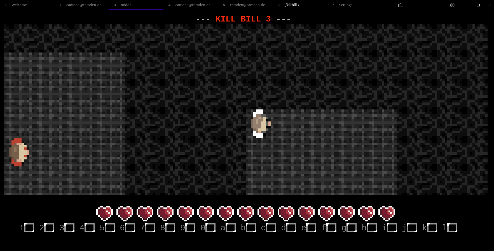

# Kill Bill 3
The long-awaited third installment of hit AAA video game series, Kill Bill (tm).

In the time since Kill Bill 2 was released, I've gotten *really* bored of GUI applications. They make me use my mouse and use awful, ugly custom graphics. Terrible!

I've had it up to here with them newfangled GUIs and web apps and other such garbage. So, capitalizing on the trend started by innovative projects like [Carbonyl](https://github.com/fathyb/carbonyl) (Chromium in your terminal), Kill Bill 3 is making the migration back to the stone ages of computer: a terminal-only game, the way it should be. No longer shall you have to double click on an application and physically move around your mouse to play this wonderful game! It works completely within the comfort of your (sixel-enabled) terminal. Wahoo!

*Yes, that's a regular old terminal, and those are PNG graphics -- no ASCII or unicode magic. Kill Bill 3 uses the Sixel format (through Notcurses) to print images to the terminal.*

*That means you can even play it from your very own VSCode!*

## What?
This repository contains the code for the semester-long assignment for a programming class at Iowa State. It was originally an ASCII-based Roguelike dungeon game, but now it uses real graphics and has been turned into the third installment of the Kill Bill series (though admittedly less cool than [Kill Bill 2](https://github.com/humeman/killbill2)).

## Run
A Makefile is provided which compiles each individual assignment into a binary.
`make` -> `./killbill3`

## Assignments
* **Assignment 1.01**: Random dungeon generator

    This program creates a randomly-generated dungeon with several rooms and corridors, and prints it out to the terminal.
* **Assignment 1.02**: Dungeon load/save

    This program enables loading/saving dungeons in an RLG327 file format. It also creates a PC character and adds debugging flags.
* **Assignment 1.03**: Pathfinding

    This program adds pathfinding capabilities to the dungeon, generating two distance
    maps (for tunneling and non-tunneling monsters) to the PC.
* **Assignment 1.04**: Monsters

    This program adds various random monsters to the dungeon and allows them to move,
    with the dungeon refreshing continually until none remain.
* **Assignment 1.05**: Game UI

    This program turns the game into an actual game with an ncurses interface.
    The PC can now move, and colors, a monster list, quit button, and staircases are added.
* **Assignment 1.06**: C++ and Fog of War

    The program has been ported to C++, and the player now has fog of war as it travels around the map
    (it can only see tiles near where it has already traveled).
* **Assignment 1.07**: Monster and Object Parsing

    The game code has been temporarily disabled to test out new monster and object parsing functionality.
    Attributes for custom monsters/items are read from the ~/.rlg327 directory, parsed, stored, and printed.
* **Assignment 1.08**: Items

    Items appear on the map now and can be picked up by the user.
* **Assignment 1.09**: Inventory and Combat

    The PC has an inventory and equipment slots now. Equipped items provide boosts in stats. Instead of characters
    dying when another character moves to their space, combat is implemented.
* **Assignment 2**: Kill Bill 3

    Remade the drawing engine to use Notcurses and Sixel graphics. Themed everything with the usual Kill Bill
    Cinematic Universe characters and items.
